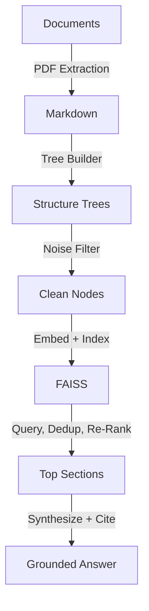

<p align="center">
  
</p>

# Proxy-Pointer Suite -- Text, Multimodal RAG, and Cross-Document Comparison 🔍

**Structural RAG for Complex Documents** — A high-fidelity retrieval pipeline that uses document hierarchy as the primary retrieval anchor, eliminating "hallucination by chunking." Proxy-Pointer indexes **structural pointers** (breadcrumbs like `Paper > Section > Sub-section`) rather than raw text fragments, ensuring the LLM always understands exactly where it is in a document.

**Retrieve precise text, get grounded visual citations, or perform Agentic section-by-section document comparisons.**

---

## Three Implementations, One Architecture

| Feature | [Text-Only](./Text-Only) | [MultiModal](./MultiModal) | [DocComparator](./DocComparator) |
| :--- | :--- | :--- | :--- |
| **Core Goal** | Maximum precision for text-based RAG | Unified reasoning across text & visuals | Agentic Cross-Document Comparison |
| **Input** | Structured Markdown (LlamaParse) | Markdown + Figures/Tables (Adobe Extract) | PDF or MD (Mixed format supported) |
| **Output** | Text-based answers | Text + $\color{#15803d}{\textsf{\textbf{AI-Verified Visual Evidence}}}$ 🖼️ | Side-by-side analytical reports |
| **LLM** | Gemini 3.1 Flash-Lite | Gemini 3.1 Flash-Lite | Gemini 3 Flash |
| **Embeddings** | gemini-embedding-001 (1536d) | gemini-embedding-001 (1536d) | gemini-embedding-001 (1536d) |
| **Vision** | — | ✅ Gemini 3.1 Flash-Lite | — |
| **Retrieval** | Structural re-ranking (k=5) | Anchor-aware re-ranking + image selection | Multi-Stage Proxy-Pointer retrieval |
| **Benchmark** | 100% on FinanceBench | 96% across 20-query, 5-paper suite | N/A (Dynamic Agentic Evaluation) |
| **Use Case** | 10-K Financials, Legal, Documentation | Anything with Images, Diagrams, Charts | Credit Agreements, Contracts, Research Papers |
| **Interface** | CLI / Python API | Streamlit UI with visual citations | Streamlit UI with markdown export |

---

## How It Works



1. **Structure trees** map every section, sub-section, figure, and table in a document
2. **Noise filtering** removes TOC, glossaries, and boilerplate using an LLM
3. **Broad vector recall** (k=200) retrieves candidates, then **LLM re-ranking** selects the best structural matches
4. **Full section loading** gives the synthesizer complete context — not truncated chunks
5. *(MultiModal only)* **Anchor-aware retrieval** surfaces figures/tables physically linked to retrieved sections

---

## Which One Should I Use?

**[Text-Only](./Text-Only)** — Best when your documents are purely text-based and the hierarchy (e.g., `Signatory > Item 1A > Risk Factors`) is the only context needed. Proven at 100% accuracy on financial 10-K filings.

**[MultiModal](./MultiModal)** — Best when your documents contain diagrams, charts, and tables that are essential to the answer. Uses anchor-aware retrieval to surface the exact images tied to a technical discussion, tested across 5 research papers (CLIP, GaLore, NemoBot, VectorFusion, VectorPainter).

**[DocComparator](./DocComparator)** — Best when you need to perform deep, section-by-section comparisons between two complex documents. Uses Agentic RAG and targeted personas (like Senior Legal Counsel) to untangle legal trade-offs and methodological differences beyond surface-level keyword matching.

---

## Architecture Deep Dive

For the full technical story behind the architecture:

1. [Proxy-Pointer Framework for Structure-Aware Enterprise Document Intelligence](https://towardsdatascience.com/proxy-pointer-framework-for-structure-aware-enterprise-document-intelligence/) — Hierarchical understanding and comparison of contracts, research papers, and more
2. [Proxy-Pointer RAG: Multimodal Answers Without Multimodal Embeddings](https://towardsdatascience.com/proxy-pointer-rag-multimodal-answers-without-multimodal-embeddings/) — Structure is all you need
3. [Proxy-Pointer RAG: Structure Meets Scale — 100% Accuracy with Smarter Retrieval](https://towardsdatascience.com/proxy-pointer-rag-structure-meets-scale-100-accuracy-with-smarter-retrieval/) — Scaling to multi-document, LLM re-ranking, and benchmark results
4. [Proxy-Pointer RAG: Achieving Vectorless Accuracy at Vector RAG Scale and Cost](https://towardsdatascience.com/proxy-pointer-rag-achieving-vectorless-accuracy-at-vector-rag-scale-and-cost/) — Core architecture & the pointer-based retrieval idea

---

## Quick Start

Install only the modality you need:

```bash
pip install pprag                 # minimal CLI shell
pip install "pprag[text]"         # text-only structural RAG
pip install "pprag[multimodal]"   # multimodal RAG with visual citations
pip install "pprag[compare]"      # cross-document comparison
pip install "pprag[full]"         # all modalities
```

Then choose the workflow from the `pprag` CLI:

```bash
pprag text index --fresh
pprag text ask

pprag multimodal index --fresh
pprag multimodal ui

pprag compare ui
```

The default install intentionally stays lightweight. If you run a modality without its optional dependencies, the CLI prints the exact extra to install, for example `pip install "pprag[multimodal]"`.

Each implementation also has its own self-contained README with a 5-minute quickstart:

- **[Text-Only → Get Started](./Text-Only/README.md)**
- **[MultiModal → Get Started](./MultiModal/README.md)**
- **[DocComparator → Get Started](./DocComparator/README.md)**

All include sample data so you can clone, build the index, and start exploring immediately.

---

## Feedback & Contact

- **GitHub Issues**: For bug reports
- **General Questions**: Reach out on [LinkedIn](https://www.linkedin.com/in/partha-sarkar-lets-talk-ai) or [Email](mailto:partha.sarkarx@gmail.com)

---

## License

© 2026 Proxy-Pointer. Licensed under [MIT](LICENSE).
